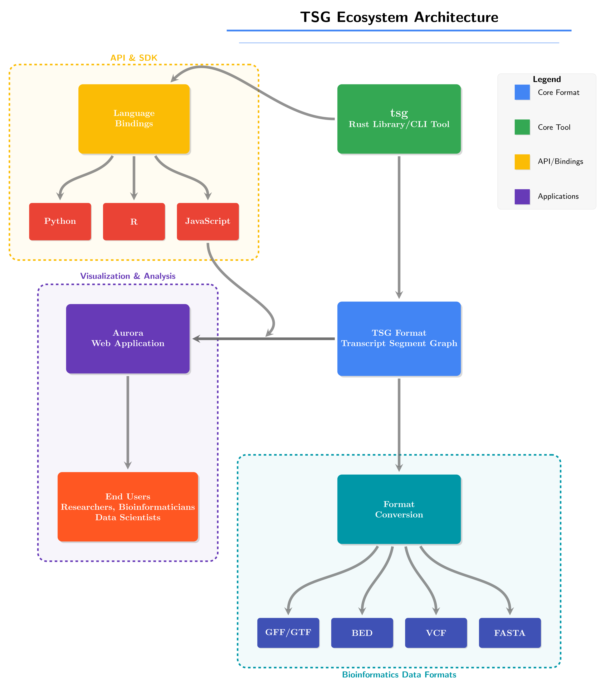

# TSG - Transcript Segment Graph

TSG is a Rust library and command-line tool for creating, manipulating, and analyzing transcript segment graphs. It provides a comprehensive framework for modeling segmented transcript data, analyzing non-linear splicing events, and working with genomic structural variants.



## Features

- Parse and write TSG format files
- Build and manipulate transcript segment graphs
- Support for multiple graphs within a single file
- Analyze paths and connectivity between transcript segments
- Support for various element types: nodes, edges, groups, and chains
- Export graphs to DOT format for visualization
- Traverse the graph to identify valid transcript paths
- Read identity tracking to ensure biological validity
- Build graphs from chains and validate path traversals
- Support for genomic coordinates with strand information
- Support for read evidence with types
- Inter-graph links for fusion events and other cross-graph relationships

## Installation

### Library

Add this to your `Cargo.toml`:

```toml
[dependencies]
tsg = "0.1.0"
```

### Command-line Tool

Install the CLI tool:

```bash
cargo install tsg
```

## Library Usage

### Loading a TSG file

```rust
use tsg::graph::TSGraph;
use std::path::Path;

fn main() -> Result<(), Box<dyn std::error::Error>> {
    // Load graph from a TSG file
    let graph = TSGraph::from_file("path/to/file.tsg")?;

    // Access graph elements
    println!("Number of graphs: {}", graph.get_graphs().len());
    println!("Number of nodes: {}", graph.get_nodes().len());
    println!("Number of edges: {}", graph.get_edges().len());

    // Export to DOT format for visualization
    let dot = graph.to_dot()?;
    std::fs::write("graph.dot", dot)?;

    // Save modified graph
    graph.write_to_file("output.tsg")?;

    Ok(())
}
```

### Working with Multiple Graphs

```rust
use tsg::graph::{TSGraph, NodeData, EdgeData};
use bstr::BString;

fn main() -> Result<(), Box<dyn std::error::Error>> {
    let mut graph = TSGraph::new();

    // Define multiple graphs
    graph.add_graph("gene_a", Some("BRCA1 transcripts"))?;
    graph.add_graph("gene_b", Some("BRCA2 transcripts"))?;

    // Add nodes to different graphs
    let node1 = NodeData::builder().id("gene_a:n1".into())
        .reference_id("chr17".into())
        .build();

    let node2 = NodeData::builder()
        .id("gene_a:n2".into())
        .reference_id("chr17".into())
        .build();

    graph.add_node(node1)?;
    graph.add_node(node2)?;

    // Add edges within each graph
    let edge1 = EdgeData {
        id: "gene_a:e1".into(),
        ..Default::default()
    };

    graph.add_edge("gene_a:n1".into(), "gene_a:n2".into(), edge1)?;

    // Add inter-graph link (e.g., for fusion transcript)
    graph.add_link("fusion1", "gene_a:n3", "gene_b:n1", "fusion", None)?;

    // Write to file
    graph.write_to_file("multi_graph.tsg")?;
    Ok(())
}
```

### Building Graphs from Chains

```rust
use tsg::graph::{TSGraph, Group};
use ahash::HashMap;

fn main() -> Result<(), Box<dyn std::error::Error>> {
    // Create chains for different graphs
    let chains = vec![
        Group::Chain {
            id: "gene_a:chain1".into(),
            elements: vec!["gene_a:n1".into(), "gene_a:e1".into(), "gene_a:n2".into()],
            attributes: HashMap::new(),
        },
        Group::Chain {
            id: "gene_b:chain1".into(),
            elements: vec!["gene_b:n1".into(), "gene_b:e1".into(), "gene_b:n2".into()],
            attributes: HashMap::new(),
        },
    ];

    // Build graphs from chains
    let graph = TSGraph::from_chains(chains)?;

    // Write to file
    graph.write_to_file("output.tsg")?;

    Ok(())
}
```

### Finding Valid Paths Through Specific Graphs

```rust
use tsg::graph::TSGraph;

fn main() -> Result<(), Box<dyn std::error::Error>> {
    let graph = TSGraph::from_file("transcript.tsg")?;

    // Find all valid paths through a specific graph
    let paths = graph.traverse_graph("gene_a")?;

    for (i, path) in paths.iter().enumerate() {
        println!("Path {}: {}", i+1, path);
    }

    Ok(())
}
```

## CLI Usage

The TSG command-line tool provides a convenient interface for common operations:

```bash
# Display help
tsg --help

# Parse and validate a TSG file
tsg validate path/to/file.tsg

# List all graphs in a TSG file
tsg list-graphs path/to/file.tsg

# Convert a specific graph to DOT format for visualization
tsg dot --graph=gene_a path/to/file.tsg > gene_a.dot

# Extract statistics from a TSG file
tsg stats path/to/file.tsg

# Find all paths through a specific graph
tsg paths --graph=gene_a path/to/file.tsg

# Find all inter-graph links
tsg links path/to/file.tsg
```

## TSG File Format

The complete TSG file format specification is available in the [docs](./docs/tsg.pdf).
The format supports multiple graphs, nodes, edges, groups, and chains, with attributes for each element.

## Contributing

Contributions are welcome! Please feel free to submit a Pull Request.

## License

[Apache-2.0](LICENSE)
